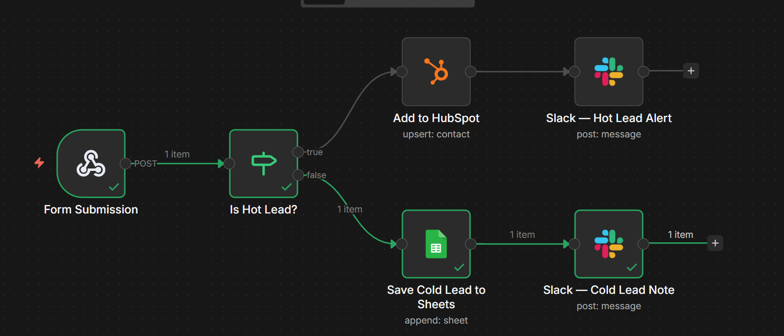

# 🎯 Lead Capture Automation

Whenever someone fills out your form, this workflow automatically:
- ✅ Saves their info to Google Sheets
- ✅ Adds them as a contact in HubSpot
- ✅ Sends them a welcome email
- ✅ Pings your team on Slack

No more copy-pasting leads manually. Ever.

---

## 🖼️ How it looks



---

## 🛠️ What you need before starting

- An [n8n](https://n8n.io) account (free tier works)
- Access to: Google Sheets, HubSpot, Gmail, and Slack

---

## ▶️ How to set it up (step by step)

**1. Import the workflow**
> In n8n → click **Workflows** → **Import** → upload `workflow.json`

**2. Connect your accounts**
> Open each node and click **"Create new credential"** to log in:

| Node | What to connect |
|---|---|
| Save to Google Sheets | Your Google account |
| Add to HubSpot | Your HubSpot account |
| Send Welcome Email | Your Gmail account |
| Notify Team on Slack | Your Slack workspace |

**3. Pick your Google Sheet and Slack channel**
> - In the Google Sheets node → select your spreadsheet and sheet tab
> - In the Slack node → select the channel for lead alerts

**4. Turn it on**
> Toggle the workflow to **Active**, then copy the webhook URL from the first node and paste it into your form as the submit destination.

---

## 📋 Your form needs to send these fields

```
firstName, lastName, email, company, phone
```

That's it! The workflow handles everything else.

---

## 🔐 Is it safe to share this file?

Yes — no passwords or API keys are stored here. All credentials stay private inside your n8n account.

---

> 💬 Questions? Open an issue or reach out!
