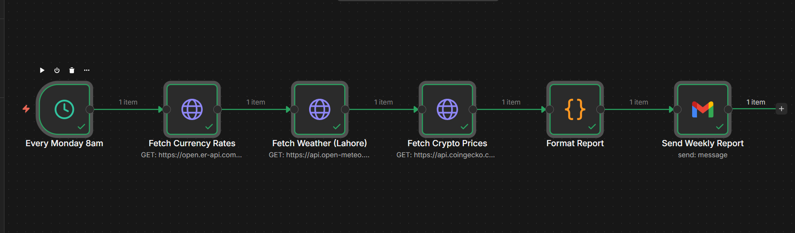
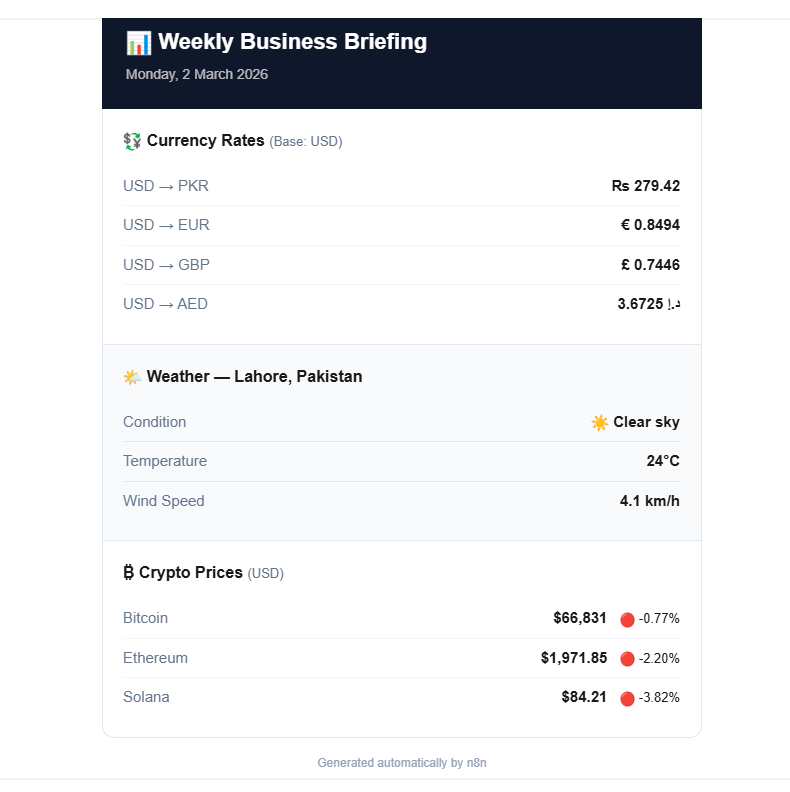

# 📊 Scheduled Weekly Business Report

Every Monday at 8am, this workflow fetches live data from 3 public APIs and delivers a clean HTML email report — automatically, no human involvement.

---

## 🖼️ Workflow



## 📧 Email Output



---

## 🔀 What It Does

```
Schedule Trigger (Every Monday 8am)
    → Fetch Currency Rates   (open.er-api.com)
    → Fetch Weather          (api.open-meteo.com — Lahore)
    → Fetch Crypto Prices    (api.coingecko.com)
    → Format Report          (Code Node — builds HTML)
    → Send Weekly Report     (Gmail)
```

| Section | Data |
|---|---|
| 💱 Currency | USD → PKR, EUR, GBP, AED |
| 🌤️ Weather | Condition, Temperature, Wind — Lahore |
| ₿ Crypto | Bitcoin, Ethereum, Solana + 24h % change |

---

## 🛠️ Setup

1. Import `workflow.json` into n8n
2. Connect **Gmail** on the Send Weekly Report node
3. Enter your email in the `sendTo` field
4. Set Gmail message type to **HTML**
5. **Activate** — runs every Monday 8am automatically

> **Test immediately:** Click **Execute Workflow** on the canvas to fire it right now without waiting for Monday.

---

## 🔧 Customization

- **City** — update lat/lng in the Weather node
- **Currencies** — edit `/latest/USD` in the Currency node URL
- **Crypto** — edit the `ids` param in the CoinGecko URL
- **Schedule** — edit cron `0 8 * * 1` (minute hour * * weekday)

---

## 🔑 APIs Used — Free, No Signup Required

| API | Endpoint |
|---|---|
| Currency | open.er-api.com |
| Weather | api.open-meteo.com |
| Crypto | api.coingecko.com |

---

## 🔐 Safe to share — no API keys or credentials stored in this file.
