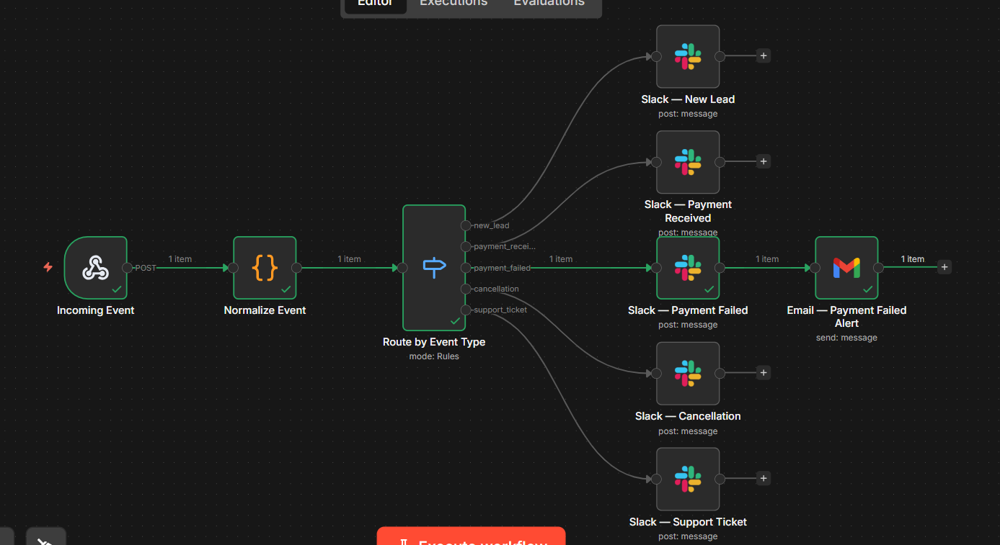

# 🔔 Team Notification Hub

One webhook receives events from any source. The workflow validates, routes by event type, posts to the right Slack channel, and escalates critical events via email — automatically.

No more every alert dumping into one channel. Every event goes exactly where it belongs.

---

## 🖼️ Workflow



---

## 🔀 What It Does

```
Incoming Event (Webhook)
    → Normalize Event  (Code Node — validate + timestamp)
    → Route by Event Type (Switch Node)
        → new_lead         → Slack 🎯
        → payment_received → Slack 💰
        → payment_failed   → Slack 🚨 + Email alert
        → cancellation     → Slack 😞
        → support_ticket   → Slack 🎫
```

---

## 🎯 Event Types

| Event | Slack | Email |
|---|---|---|
| `new_lead` | ✅ | ❌ |
| `payment_received` | ✅ | ❌ |
| `payment_failed` | ✅ | ✅ Critical |
| `cancellation` | ✅ | ❌ |
| `support_ticket` | ✅ | ❌ |

---

## 🛠️ Setup

1. Import `workflow.json` into n8n
2. Connect **Slack** on all 5 Slack nodes (same credential)
3. Connect **Gmail** on the Payment Failed Alert node
4. Select your Slack channels in each node
5. Add your email to the Gmail `sendTo` field
6. **Activate** → copy production webhook URL

---

## 📋 Test Payloads

```json
{ "eventType": "new_lead", "name": "Sara Khan", "email": "sara@techcorp.com" }
```
```json
{ "eventType": "payment_failed", "name": "Ahmed Ali", "email": "ahmed@example.com", "amount": "149.99" }
```
```json
{ "eventType": "cancellation", "name": "John Smith", "email": "john@example.com", "message": "Too expensive" }
```
```json
{ "eventType": "support_ticket", "name": "Maria Garcia", "email": "maria@example.com", "message": "Can't login" }
```

> Payment failed is the only event that triggers both Slack **and** an email escalation.
