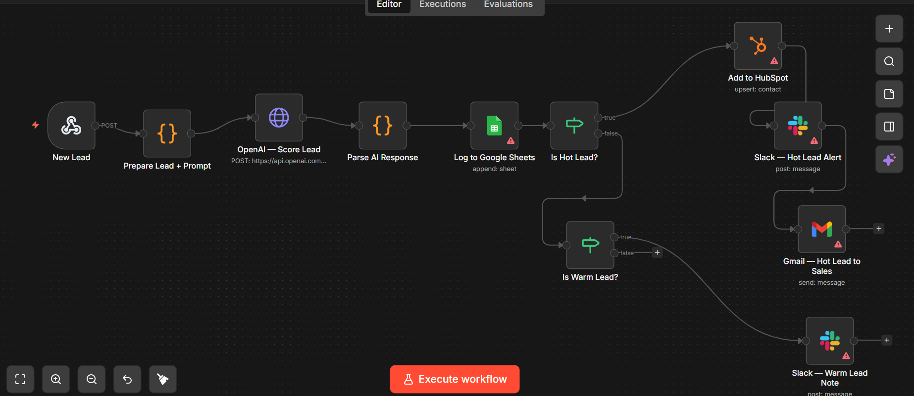

# 🤖 AI Lead Qualifier — GPT-Powered Lead Scoring & Auto Routing

Every lead that comes in gets automatically scored 1-10 by GPT-4o-mini, labeled Hot/Warm/Cold, and routed accordingly — in under 5 seconds. No manual review, no missed opportunities.

---

## 🖼️ Workflow



---

## 🔀 What It Does

```
New Lead (Webhook)
    → Prepare Lead + Prompt  (Code Node — format data for AI)
    → OpenAI GPT-4o-mini     (HTTP Request — score the lead)
    → Parse AI Response      (Code Node — extract score/label/action)
    → Log to Google Sheets   (every lead, regardless of tier)
    → Is Hot? (Score 8-10)
        ✅ YES → HubSpot + Slack 🔥 alert + Gmail to sales
        ❌ NO  → Is Warm? (Score 5-7)
                    ✅ YES → Slack 🌤️ low-priority note
                    ❌ NO  → Sheets only (Cold, no action)
```

---

## 🎯 AI Scoring Tiers

| Tier | Score | Criteria | Actions Triggered |
|---|---|---|---|
| 🔥 Hot | 8–10 | Decision maker, clear budget, urgent need | HubSpot + Slack + Gmail |
| 🌤️ Warm | 5–7 | Interested but vague budget or role | Slack note only |
| 🧊 Cold | 1–4 | Student, no budget, generic inquiry | Logged silently |

---

## 🛠️ Setup

**1. Get your OpenAI API key**
> platform.openai.com → API Keys → Create key → add $5 credit (enough for ~5000 leads)

**2. Replace the placeholder in the HTTP Request node**
> `Authorization` header → replace `YOUR_OPENAI_API_KEY` with your real key

**3. Create a Google Sheet** with these headers:
```
name | company | email | role | budget | message | source | score | label | action | reason | submittedAt
```

**4. Connect credentials** — Google Sheets, HubSpot, Slack, Gmail

**5. Set your sales email** in the Gmail node `sendTo` field

**6. Activate** → copy the production webhook URL → point your lead form to it

---

## 📋 Payload Format

```json
{
  "name": "James Wilson",
  "company": "TechCorp Solutions",
  "email": "james@techcorp.com",
  "role": "CTO",
  "budget": "$5000/month",
  "message": "We need to automate our entire sales pipeline immediately.",
  "source": "LinkedIn"
}
```

---

## 🧪 Test All 3 Tiers

**Hot lead** — CTO with budget and urgency → should score 8-10
**Warm lead** — Manager, interested but vague → should score 5-7
**Cold lead** — Student, no budget → should score 1-4

---

## 💼 The Pitch

> "Your sales team manually reads every lead to decide who's worth calling. This workflow uses AI to score every lead the moment it arrives — Hot leads go straight into your CRM with an alert, Cold leads are filtered out automatically. Your team only touches leads that are actually worth their time."

---

## 🔐 Before pushing to GitHub — remove your OpenAI API key from the HTTP Request node header and replace with `YOUR_OPENAI_API_KEY`.
